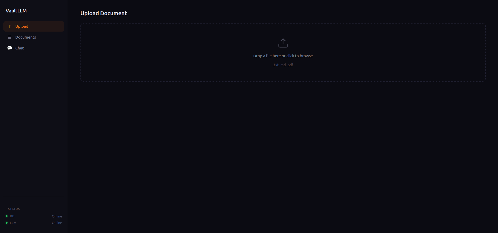
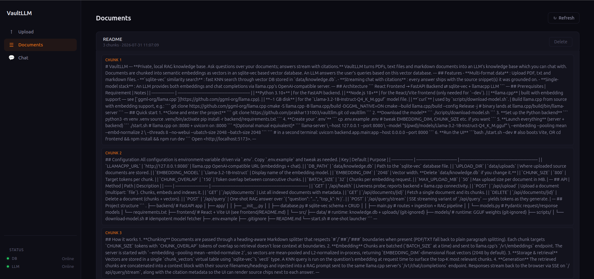
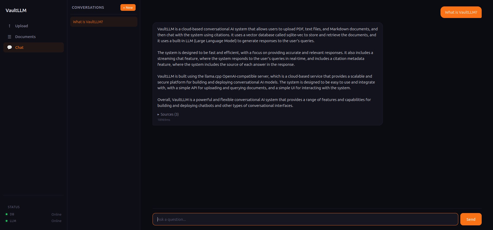

# VaultLLM
---

**Private, local RAG knowledge base. Ask questions over your documents; answers stream with citations.**

VaultLLM turns PDFs, text files and markdown documents into an LLM's knowledge base which you can chat with. Documents are chunked into semantic embeddings as vectors in an sqlite-vec based vector database. An LLM answers the user's queries based on this vector database.





---

## Features

- **Multi-format data** : Upload PDF, txt and markdown files.
- **`sqlite-vec` similarity search** : Fast KNN search through vector DB stored in `data/knowledge.db`.
- **Streaming chat with citations** : Every answer cites a source.
- **Single-model stack** : One LLM provides both embeddings and chat completions via llama-server.

---

## Architecture

```
React Frontend → FastAPI Backend ⇄ sqlite-vec + llamacpp LLM 
```
---

## Prerequisites

- **Python 3.10+** : For FastAPI backend.
- **Node.js 18+** : For React/Vite frontend.
- **llama.cpp (with embedding support)** : For LLM autoregressive text generation and vector embeddings.

---
## Installation

## Step 1: Create the main directory and clone the repo, then create directories where the system stores runtime data and uploaded files.

```bash
mkdir -p VaultLLM
cd VaultLLM
git clone https://github.com/prakhar131003/vaultllm.git
mkdir -p data data/uploads models
```

## Step 2: Set Up Python Virtual Environment and Install Dependencies

```bash
python3 -m venv .venv
./.venv/bin/pip install --upgrade pip
./.venv/bin/pip install -r backend/requirements.txt
touch .venv/.deps-installed
```

## Step 3: Set Up Configuration File (.env)

Copy the template configuration file and from it make a .env file for your environment settings.

## Step 4: Download the LLM using wget

```bash
wget -O models/Llama-3.2-1B-Instruct-Q4_K_M.gguf \
 "https://huggingface.co/bartowski/Llama-3.2-1B-Instruct-GGUF/resolve/main/Llama-3.2-1B-Instruct-Q4_K_M.gguf"
```

## Step 5: Install Frontend Dependencies

```bash
cd frontend
npm install
cd ..
```

## Step 6: Run the Services

1. **Backend Server (Uvicorn):**
```bash
./.venv/bin/uvicorn backend.app.main:app --reload --port 8000
```

2. **Frontend Development Server (Vite):**
```bash
cd frontend
npm run dev
```
Once running, access the web UI at `http://localhost:5173`

---

## API

| Method | Path                       | Description                                                                  |
| ------ | -------------------------- | ---------------------------------------------------------------------------- |
| `GET`  | `/api/health`              | Liveness probe; reports backend + llama.cpp connectivity.                    |
| `POST` | `/api/upload`              | Upload a document (multipart: `file`). Chunks, embeds and indexes it.        |
| `GET`  | `/api/documents`           | List all indexed documents with metadata.                                    |
| `GET`  | `/api/documents/{id}`      | Fetch a single document and its chunks.                                      |
| `DELETE` | `/api/documents/{id}`    | Delete a document (chunks + vectors).                                        |
| `POST` | `/api/query`               | One-shot RAG answer over `{ "question": "...", "top_k": N }`.               |
| `POST` | `/api/query/stream`        | SSE streaming variant of `/api/query` — yields tokens as they generate.     |

---

## How it works

1. **Chunking**
   Documents are passed through a heading-aware Markdown splitter that respects
   `#`/`##`/`###` boundaries when present (PDF/TXT fall back to plain paragraph
   splitting). Each chunk targets `CHUNK_SIZE` tokens with `CHUNK_OVERLAP` tokens
   of overlap so retrieval doesn't lose context at boundaries.

2. **Embedding**
   Chunks are batched (`BATCH_SIZE` at a time) and sent to llama.cpp's
   `/v1/embeddings` endpoint. The server is started with `--embedding
   --pooling mean --embd-normalize 2`, so vectors are mean-pooled and
   L2-normalized in-process, returning `EMBEDDING_DIM`-dimensional float
   vectors (2048 by default).

3. **Storage & retrieval**
   Vectors are stored in a single `chunk_vectors` virtual table using
   `sqlite-vec`'s `vec0` type. A KNN query is run on the question's
   embedding at request time to surface the top-K most relevant chunks.

4. **Generation**
   The retrieved chunks are concatenated into a context block with their
   source filenames/headings and injected into a RAG prompt sent to the same
   llama.cpp server's `/v1/chat/completions` endpoint. Responses stream back
   to the browser via SSE on `/api/query/stream`, along with the citation
   metadata so the UI can render source chips next to each answer.

---
